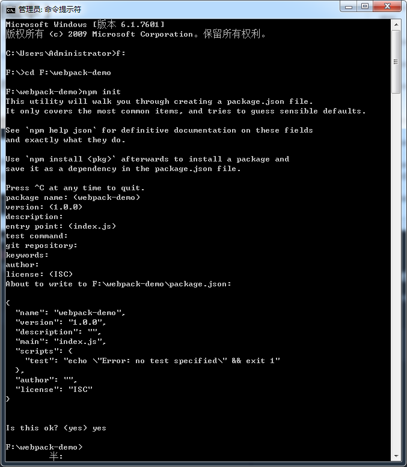

## Webpack4搭建Vue项目
1. 安装node，新建一个项目文件夹，然后在该文件夹下使用npm init（初始化项目）
```bash
npm init
```


2. npm i webpack vue vue-loader，同级创建src（在该目录下创建app.vue及index.js文件）、config(创建webpack.config.base.js、webpack.config.dev.js、webpack.config.build.js)
```bash
npm i webpack vue vue-loader
```

3. 在src目录下的app.vue中写入代码：
```html
<template>
  <div id="test">{{test}}</div>
<template>
<script>
    export default {
        data(){
            return{
                test:'vueDemo'
            }
        }
    }
</script>

<style>
  #test{
      color:red;
  }
</style>
```
index.js中写入：
```html
import Vue from 'vue'
import app from './app.vue'
new Vue({
  render:(h)=>h(app)
})
```

4. 新建config目录，目录中创建webpack.config.base.js、webpack.config.dev.js、webpack.config.build.js

①webpack.config.base.js：这里用来配置开发和生产中的公共webpack配置，我们需要用到以下插件:
```bash
npm i url-loader file-loader html-webpack-plugin
```

webpack.config.base.js简单配置如下：
```javascript
const path=require('path')
const {VueLoaderPlugin}=require('vue-loader')
const HtmlWebpackPlugin=require('html-webpack-plugin')
module.exports={
  //输入
  entry:{
    path:path.join(__dirname,'../src/index.js'),
  },
  //输出
  output:{
    path:path.join(__dirname,'../dist'),
    filename:'bundle.js'
  },
  resolve: {
    alias:{
      'vue$':'vue/dist/vue.esm.js'//配置别名 确保webpack可以找到.vue文件
    },
    extensions: ['.js', '.jsx','.json']
  },
  mode:process.env.NODE_ENV,
  module:{
    rules:[
      {
        test:/\.vue$/,
        use:'vue-loader'
      },
      {
        test:/\.(png|jpg|jepg|svg)$/,
        use:[
          {
            loader:'url-loader',
            options:{
              limit:1024,  //这里的单位是b
              name:'images/[name][hash].[ext]' //打包后输出路径
            }
          }
        ]
      }
    ]
  },
  plugins:[
    new VueLoaderPlugin(),
    new HtmlWebpackPlugin({
      template:'./index.html',
      inject: 'body',
      minify: {
        removeComments: true
      }
    })
  ]
}
```

②webpack.config.dev.js，这里我们需要将base的配置合并到dev中，需要用到webpack-merge
```bash
npm i webpack-merge
```

下载好后，还需安装css-style style-loader,用来解析css文件
```bash
npm i style-loader css-loader
```

配置开发环境，需用到webpack-dev-server
```
npm i webpack-dev-server
```

webpack.config.dev.js中简单配置如下：
```javascript
const base=require('./webpack.config.base')
const {merge}=require('webpack-merge')   // webpack4的正确写法
const webpack=require('webpack')

module.exports=merge(base,{
  devServer:{
    port:8089,
    host:'127.0.0.1',
    open:true,
    hot:true,
    overlay:{erros:true}
  },
  module:{
    rules:[
      {
        test:/\.css$/,
        use:['style-loader','css-loader']
      }
    ]
  },
  plugins:[
    new webpack.HotModuleReplacementPlugin()
  ]
})
```

现我们需要执行开发启动命令 npm run dev，所以我们还需要用到一个设置当前执行环境的插件cross-env
```bash
npm i cross-env
```

下载好后，再package.json中配置：
```json
"scripts": {
  "test": "echo \"Error: no test specified\" && exit 1",
  "dev": "cross-env NODE_ENV=development webpack-dev-server --config config/webpack.config.dev.js"
},
```

安装webpack-cli
```bash
npm i -D webpack-cli
```

安装vue-template-compiler
```bash
npm i vue-template-compiler
```

添加项目根目录下添加index.html文件：
```html
<!DOCTYPE html>
<html lang="zh-CN">

<head>

</head>
<body>
  <div id="app" style="color:red;">
    vueDemo
  </div>
</body>

</html>
```

运行项目,即可在浏览器中访问到index.html页面了
```bash
npm run dev
```

安装vue-router
```bash
npm i vue-router
```

创建components/home/index.vue、components/mine/index.vue
创建router目录，里面再创建router.js，添加如下内容：
```javascript
import Vue from 'vue'
import Router from 'vue-router'
import Home from '../components/home/index.vue'
import Mine from '../components/mine/index.vue'
Vue.use(Router);
export default new Router({
  routes:[
    {
      path:'/',
      name:'home',
      component:Home
    },
    {
      path:'/mine',
      name:'mine',
      component:Mine
    }
  ]
})
```

然后index.js 改为：
```javascript
import Vue from 'vue'
import app from './app.vue'
import router from '../router/router.js'

new Vue({
  el:'#app',
  router,
  render:(h)=>h(app)
})
```

app.vue改成
```html
<template>
   <router-view/>
</template>
<script>
export default {
  name:'app'
}
</script>
```

③webpack.config.build.js
首先我们需要把css从代码中分离出来，我们使用mini-css-extract-plugin
```bash
npm i mini-css-extract-plugin
```

每次打包后清除dist文件，安装clean-webpack-plugin
```bash
npm i clean-webpack-plugin
```

配置打包命令
```json
"scripts": {
  "test": "echo \"Error: no test specified\" && exit 1",
  "dev": "cross-env NODE_ENV=development webpack-dev-server --config config/webpack.config.dev.js",
  "build": "cross-env NODE_ENV=production webpack --config config/webpack.config.build.js"
},
```

把node_modules单独打包。build的简单配置如下：
```javascript
const base=require('./webpack.config.base')
const {merge}=require('webpack-merge')    // webpack4的写法
const MiniCssExtractPlugin =require('mini-css-extract-plugin')
const {CleanWebpackPlugin}=require('clean-webpack-plugin')

module.exports=merge(base,{
  output:{
    filename:'js/[name][hash].js',
    chunkFilename:'js/vendor[id][hash].js'
  },
  optimization: {
    splitChunks: {
      cacheGroups: {
        styles: {
          name: 'styles',
          test: /\.css$/,
          chunks: 'all',
          enforce: true
        },
        vendor:{
          test: /node_modules/,
          name: 'vendor',
          chunks:'all'
        }
      }
    }
  },
  module:{
    rules:[
      {
        test:/\.css$/,
        use:[
          {
            loader:MiniCssExtractPlugin.loader
          },
          'css-loader'
        ]
      }
    ]
  },
  plugins:[
    new MiniCssExtractPlugin({filename:'css/[hash].css'}),
    new CleanWebpackPlugin()
  ]
})
```

执行下npm run build，已经可以正常打包了
```bash
npm run build
```